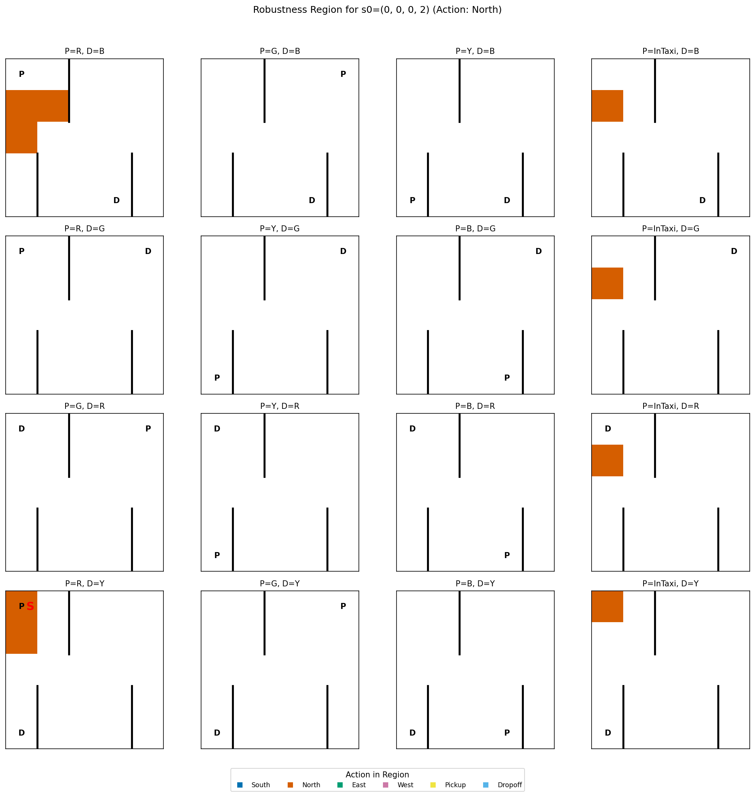
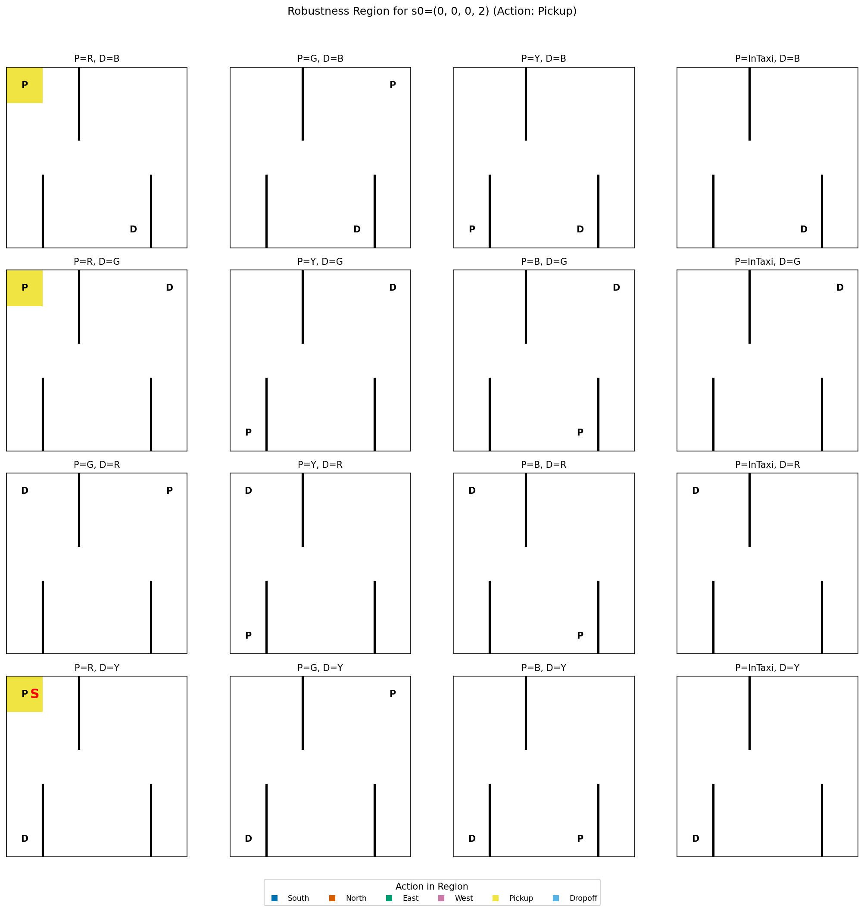

# STACHE – State–Action Transparency through Counterfactual & Robustness Explanations

[](LICENSE)
[](https://www.python.org/)
[](docs/MSc_Thesis_Andrew_Elashkin_2025.pdf)

STACHE explains deterministic policies over discrete, factored state spaces. It
computes a policy's connected robustness region (RR), policy-changing boundary,
and minimal counterfactual states (CFs), while keeping scientific completeness
separate from partial observations caused by resource limits.

The generic RR core is domain-neutral. Taxi-v3 is the first fully registered
connector; MiniGrid remains on its historical explanation path while its broader
scientific state-universe and codec decisions are reviewed.

## Illustrative Taxi checkpoints

These committed images compare an earlier and a later Taxi DQN checkpoint for
the same seed state `s = (0, 0, 0, 2)`. They are illustrations, not a claim that
the filenames encode exact percentages of a common training schedule.

| Earlier committed checkpoint | Later committed checkpoint |
| :---: | :---: |
|  |  |

## Scientific contract

The normative definitions come from the
[MSc thesis](docs/MSc_Thesis_Andrew_Elashkin_2025.pdf) and the accompanying
OO-MDP formulation.

### Object projection, distance, and graph

A versioned projection `φ` maps each raw environment state to a canonical
object/factor state. Distance is evaluated on that projection, not on a model's
observation vector. For the domains in this repository, the hybrid distance is

```text
d(s, s') = Σ |numeric_i(s) - numeric_i(s')|
         + Σ [categorical_j(s) != categorical_j(s')]
```

Distinct states are adjacent when `0 < d(φ(s), φ(s')) <= ε`. STACHE fixes
`ε = δ = 1`: every graph edge is one formal unit change.

Taxi projects a raw index in `0..499` to
`(row, column, passenger, destination)`. Row and column use Manhattan distance;
passenger and destination use categorical Hamming distance. The flat float32
500-way one-hot vector is a separate model-observation codec and is not part of
the scientific distance.

### Robustness region

For seed `s0`, the RR is the connected component containing `s0` in which every
state has the seed action `π(s0)`. Connectivity is defined by the connector's
unit graph, not by Taxi road dynamics.

### Minimal counterfactuals

A counterfactual changes the seed action. STACHE distinguishes two minimum
claims:

| Basis | Claim |
| --- | --- |
| `graph_boundary` | Minimum graph-hop depth among immediate policy-changing RR boundary states |
| `formal_global` | Minimum formal distance among every policy-changing state in the declared universe |

The claims coincide only when a sufficient geodesic metric certificate (or an
independently correct increasing formal-distance provider) justifies it. Every
tied minimum is part of the formal contract.

## Install

STACHE currently supports Python `>=3.11,<3.12`.

```bash
git clone https://github.com/aelashkin/STACHE.git
cd STACHE
python3.11 -m venv .venv
source .venv/bin/activate
python -m pip install .
```

For tests and tuning dependencies:

```bash
python -m pip install -e '.[dev]'
```

PyTorch installation varies by platform. If a non-CPU build is required,
install the appropriate wheel from the official
[PyTorch selector](https://pytorch.org/get-started/locally/) before installing
STACHE.

## Compute a Taxi explanation

The installed CLI accepts either a complete policy table or a trusted
Stable-Baselines3 DQN archive. The committed model example is:

```bash
stache compute-rr \
    --domain taxi \
    --state-universe taxi-factored-500 \
    --seed 2 \
    --model data/experiments/models/Taxi-v3_DQN_model_100/model.zip \
    --acknowledge-trusted-model \
    --minimum-basis formal_global \
    --counterfactuals both \
    --extent exact \
    --output result.yaml
```

Model mode requires a versioned `model.manifest.yaml` beside `model.zip` by
default; `--model-manifest` selects another path. The sidecar binds the exact
archive SHA-256, the `taxi-one-hot-500` observation identity/version/scope, and
the six-action contract. It is an identity check, not authentication.

`--acknowledge-trusted-model` is deliberately separate: Stable-Baselines3
archives may deserialize Python objects. STACHE validates and snapshots a
trusted archive before loading it, then fingerprints and loads the same bytes,
but it does not sandbox the model or establish its provenance.

Budgeted searches report a partial result instead of silently claiming exact
completion. `max_policy_queries=0` is meaningful in the Python API only when the
seed action is already cached; the CLI's fresh table/model workflows require at
least one query to define the seed action.

## Result artifacts

Current RR artifacts use `stache.rr-result` schema version 2 and core schema
version 2. Primitive-only YAML records include:

- object projection, factorization, topology, adjacency threshold, universe,
  metric, certificate, and state/key codec identities;
- policy fingerprint/source plus model observation and action identities;
- minimum basis, extent, resource ceilings, result records, and statistics;
- separate region, boundary, radius, and all-minima completeness evidence;
- stop reason, counterfactual existence, continuation metadata, and provenance.

Loading rejects duplicate mapping keys, contradictory identities, unsupported
versions, non-canonical state/key records, and invalid completeness evidence.
Artifacts are evidence-bearing records, not signed authenticity proofs; use an
expected policy fingerprint from a trusted channel when authenticity matters.

See [ADR 0001](docs/architecture/0001-generic-rr-core-and-taxi.md) for the
architecture and [RR core v2 migration](docs/migration/rr-core-v2.md) for
incompatible schema and API changes.

## Visualize Taxi results

Both model-loading visualizers require the same explicit trust decision and
semantic sidecar as `stache compute-rr`.

```bash
stache-viz-rr-taxi \
    --model-path data/experiments/models/Taxi-v3_DQN_model_100 \
    --state '0,0,0,2' \
    --acknowledge-trusted-model

stache-viz-policy-map \
    --model-path data/experiments/models/Taxi-v3_DQN_model_100 \
    --acknowledge-trusted-model
```

The RR visualizer writes the canonical versioned result artifact and refuses to
replace it unless `--overwrite` is supplied. The policy-map visualizer uses a
timestamped directory; a fixed existing timestamp also requires `--overwrite`.
Both views include all 500 Taxi tuples, including `P == D`.

## Training and model manifests

Taxi training is explicit and long-running; it is never started by importing
the module:

```bash
stache-train-taxi
```

The training wrapper delegates all 500 one-hot observations to `TaxiConnector`.
Saving a Taxi experiment writes `model.zip` and an atomic
`model.manifest.yaml` bound to the saved bytes. Do not run model training or
Optuna tuning as part of ordinary validation.

MiniGrid training/evaluation scripts are retained as historical research
workflows. They are not yet registered with the generic RR core and should not
be interpreted as a documented MiniGrid scientific-universe decision.

## MiniGrid direction relation

The broader MiniGrid universe, object ordering, codec, state injection, and
metric certificate remain deferred. One narrow neighbor contract is fixed:
headings are adjacent only after one environment turn, left or right by 90°.
The opposite heading requires two turns and is not adjacent. This matches the
official [MiniGrid 3.0.0 step implementation](https://github.com/Farama-Foundation/Minigrid/blob/v3.0.0/minigrid/minigrid_env.py).

## Validation and reproduction scope

Phase 1 validates the Taxi scientific path with independent toy oracles,
exhaustive 500-state connector checks, all 250,000 ordered Taxi state pairs,
arbitrary deterministic 500-state tables, artifact round trips, and parity
checks for a committed DQN. Historical figures and scripts remain available,
but STACHE does not claim that every historical figure is regenerated from an
exact public seed/config manifest, nor that MiniGrid artifacts have been
revalidated under the generic core.

## Project layout

```text
├── config/                    # Historical training/tuning presets
├── data/experiments/          # Committed models and generated experiment data
├── docs/                      # Thesis, architecture, and migration decisions
├── scripts/                   # Historical research helpers
├── src/stache/
│   ├── envs/                  # Environment factories and wrappers
│   ├── explainability/core/   # Domain-neutral RR/CF contracts and search
│   ├── explainability/connectors/ # Domain scientific adapters
│   ├── explainability/taxi/   # Taxi compatibility and rendering consumers
│   ├── pipelines/             # Explicit training workflows
│   └── utils/                 # Experiment I/O and safe configuration helpers
└── tests/                     # Unit, exhaustive connector, and CLI tests
```

## Contributing

Changes should include contract tests appropriate to their scientific impact.
The repository's supported local checks are:

```bash
python -m pytest -q -p no:cacheprovider
python -m pip wheel . --no-deps --wheel-dir /tmp/stache-dist
```

No Ruff/Black or hosted CI gate is currently declared in this repository; do
not report those checks as passing unless they are added and actually run.

## Citing

```bibtex
@misc{Elashkin2025,
  author    = {Elashkin, Andrey and Grumberg, Orna},
  title     = {Counterfactual and Robustness-Based Explanations for Reinforcement Learning Policies},
  year      = {2025},
  publisher = {Technion - Israel Institute of Technology},
  keywords  = {Reinforcement learning; Intelligent agents; Markov processes; Multiagent systems},
  note      = {MSc Thesis. Supervision: Orna Grumberg}
}
```

## License

Distributed under the [MIT License](LICENSE).

## Acknowledgements

Built on [Gymnasium](https://gymnasium.farama.org/),
[MiniGrid](https://github.com/Farama-Foundation/MiniGrid),
[Stable-Baselines3](https://stable-baselines3.readthedocs.io/), and
[Optuna](https://optuna.org/).
